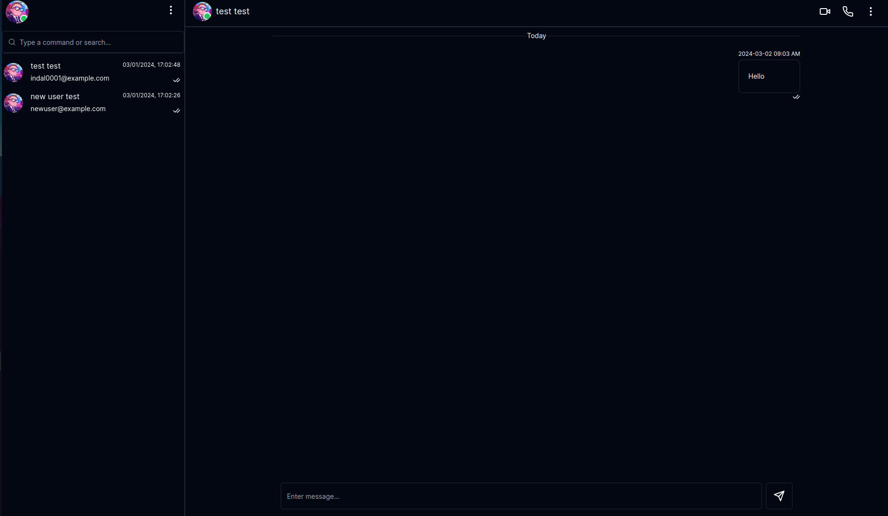
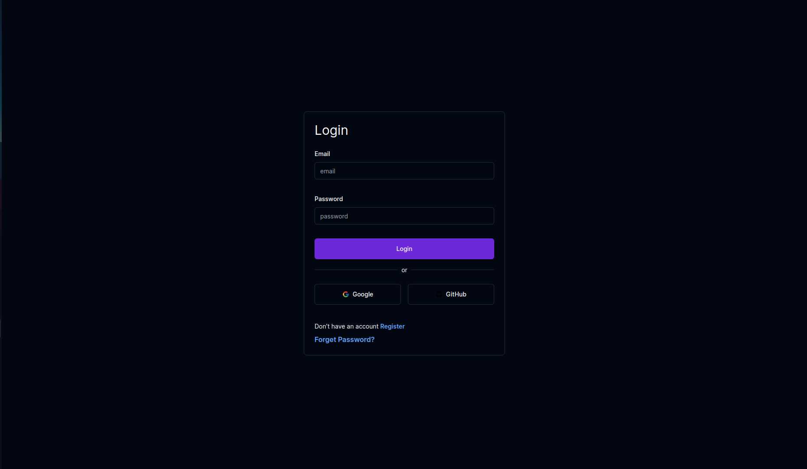

# MeetSpace

#Screenshots





# Tech Stack

This project utilizes the following technologies:

- **Frontend**

  - React
  - Next.js - Framework for building server-side rendered React apps
  - Shadcn - UI component
  - Tailwindcss - for component styling.
  - axios - Fetching, caching

**Infrastructure**

- Docker - Containerization
- Docker-Compose - For managing multiple container services
- Nginx - Web server
- Github Actions - Continuous integration & deployment

## Development(Run Locally)

First, run the development server:

```bash
npm run dev
# or
yarn dev
```
